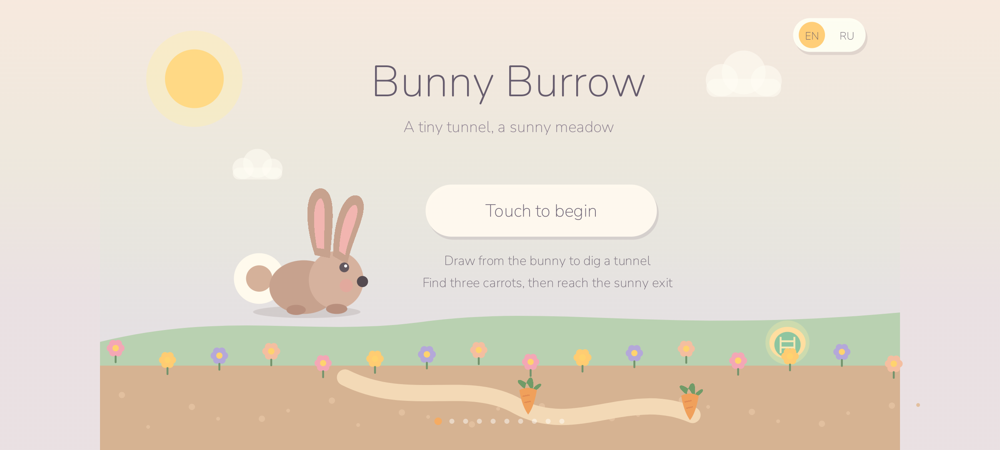
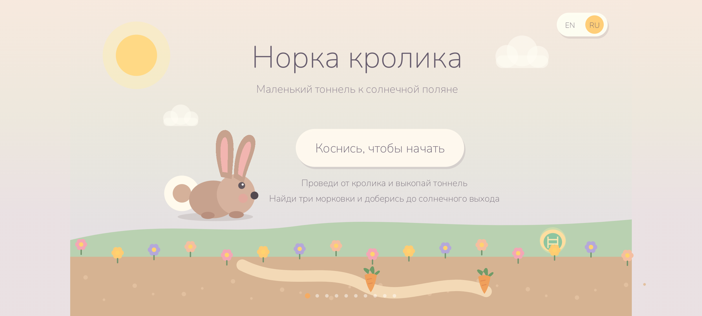
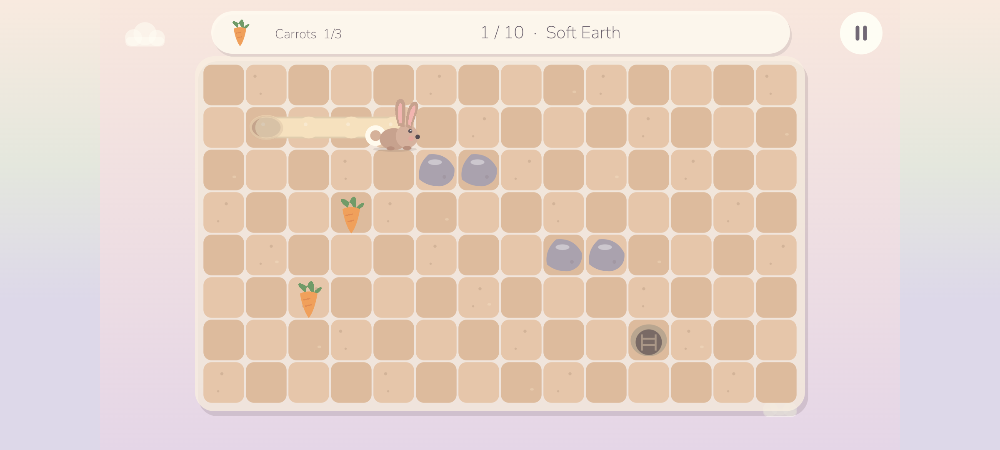
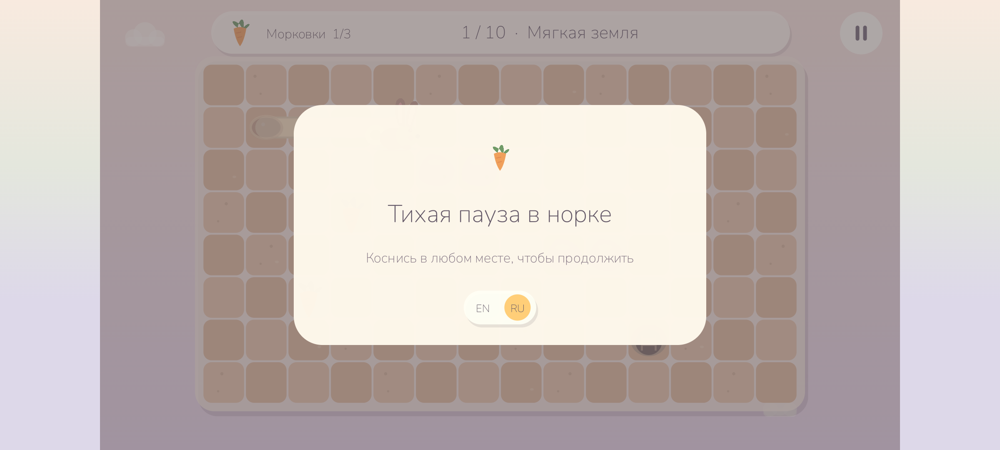

# Bunny Burrow

**Author:** `cocomelonc`  
**Copyright:** © 2026 cocomelonc (Zhassulan Zhussupov)

Bunny Burrow is a calm, one-finger Android tilemap game for children. Draw a
tunnel through soft earth, watch a tiny rabbit hop along it, find three
carrots, and reach the sunny exit. There are no ads, accounts, purchases,
trackers, network calls, timers, lives, or game-over screens.

The game starts in English and includes an in-game `EN / RU` switch. Latin and
Cyrillic use the same bundled Nunito typeface.

| English | Русский |
|---|---|
|  |  |





## Gameplay

- Touch the rabbit or an adjacent tile and drag through soft earth.
- The tunnel appears under the finger and the rabbit follows with smooth hops.
- Stones, roots, and underground water cannot be dug through.
- Tapping any old tunnel gently routes the rabbit back through dug cells.
- Find all three carrots, then enter the glowing sunny exit.
- Tunnels remain open, progress is local, and there is no failure state.

## Ten burrows

- **Soft Earth** — a spacious introduction to drawing tunnels.
- **Little Roots** — the first roots and simple detours.
- **Pebble Patch** — small stone clusters break up straight routes.
- **Minty Stream** — underground water creates two gentle passages.
- **Carrot Corner** — carrots sit around long root rows.
- **Clover Burrow** — branching clover roots encourage exploration.
- **Twisty Tunnel** — a readable compact root maze.
- **Peach Soil** — warm soil with orchard-like stone lines.
- **Moonlit Burrow** — pools and a quiet evening palette.
- **Sunny Meadow** — a final mix of roots, stones, and water.

Every level is a real 14×8 tilemap. Automated tests prove that all carrots and
the exit are reachable, then complete all ten levels by drawing only valid
adjacent tunnel cells through the production game rules.

## Deliberately small and private

- Native Java and Android Canvas; no game engine or runtime dependencies.
- Original procedural artwork; no downloaded tileset or image-license risk.
- Original procedural effects and calm background music; no sampled audio
  files or codec dependency.
- One activity, one custom view, and a pure-Java gameplay core.
- English and Russian bundled in every APK and AAB.
- No Internet, advertising ID, analytics, or native `.so` libraries.

## Pause-card layout

The pause and completion cards animate in smoothly and reserve 72 logical
pixels of horizontal content padding. Both English and longer Russian text are
measured at runtime and fitted inside that safe area. The language selector also
has independent space below the subtitle, so no label touches a card edge.

## Android configuration

| Setting | Value |
|---|---:|
| Application ID | `com.cocomelonc.bunnyburrow` |
| Minimum SDK | 26 (Android 8.0) |
| Target SDK | 36 (Android 16) |
| Compile SDK | 36 |
| Java | 17 |
| Android Gradle Plugin | 8.9.1 |
| Gradle | 8.11.1 |

Android 15/API 35 lies inside the declared compatibility range `26..36`.
The verification script reads the final APK manifest, rejects network/ad
permissions and native libraries, and checks signature and 16 KB ZIP alignment.

The debug APK was clean-installed and exercised on a Pixel 7 emulator running
Android 16/API 36. Runtime checks covered launch, landscape scaling, drag-to-dig
input, smooth hopping, carrot collection, tunnel backtracking, pause animation,
music playback/pause and Audio Focus release, Android Back, the `EN / RU`
switch, and Cyrillic layout. The screenshots above come from that APK rather
than a design mock-up.

## Build and verify

```bash
export ANDROID_HOME="$HOME/Android/Sdk"
export JAVA_HOME=/path/to/jdk-17
./scripts/verify_android.sh
```

The debug APK is written to:

```text
app/build/outputs/apk/debug/app-debug.apk
```

Build an unsigned release bundle with:

```bash
./gradlew bundleRelease
```

Configure an upload key outside the repository before publishing. Never commit
a keystore or its passwords.

## Controls

- Touch or drag from the rabbit: dig connected tunnel cells.
- Tap an existing tunnel: return through the dug route.
- Top-right pause button or Android Back: pause.
- `EN / RU`: switch language on the title or pause card.
- Android Back from pause: return to the title screen.

## Project layout

```text
app/src/main/java/com/cocomelonc/bunnyburrow/
  MainActivity.java       edge-to-edge Android host and lifecycle
  BunnyBurrowView.java    procedural drawing, drag input, particles, UI
  BunnyWorld.java         testable tunnel and objective rules
  BurrowLevel.java        ten immutable 14×8 tilemaps and palettes
  AudioEngine.java        tiny procedural sound synthesizer
  MusicEngine.java        calm original procedural background music
app/src/test/             full-journey and reachability tests
art/                      procedural-art licensing notes and screenshots
third_party/nunito/       exact SIL OFL license for the bundled font
scripts/                  reproducible Android verification
```

## Privacy and license

The app is intentionally offline and does not collect or transmit data. See
[PRIVACY.md](PRIVACY.md).

Project source, original procedural artwork, sound effects, and music are under
the MIT License; see [AUDIO.md](AUDIO.md). Nunito remains under the SIL Open
Font License 1.1; see
[`third_party/nunito/OFL.txt`](third_party/nunito/OFL.txt).

Bunny Burrow was created by **cocomelonc**. See [AUTHORS.md](AUTHORS.md),
[LICENSE](LICENSE), and [CONTRIBUTING.md](CONTRIBUTING.md).

---

## Русский

Bunny Burrow — маленькая спокойная Android-игра. Проведите пальцем от кролика,
выкопайте тоннель, найдите три морковки и доберитесь до солнечного выхода.
Здесь нет рекламы, регистрации, аналитики, сетевого доступа, таймеров и экрана
проигрыша. Язык переключается кнопкой `EN / RU`; латиница и кириллица используют
один встроенный шрифт Nunito.
